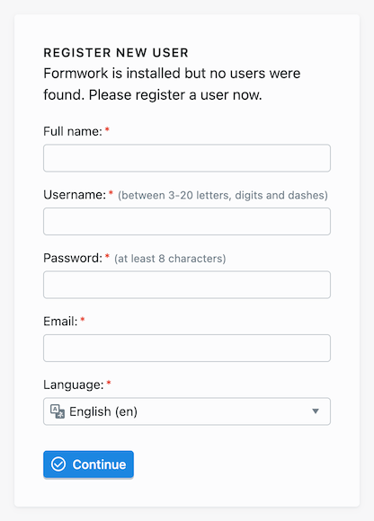
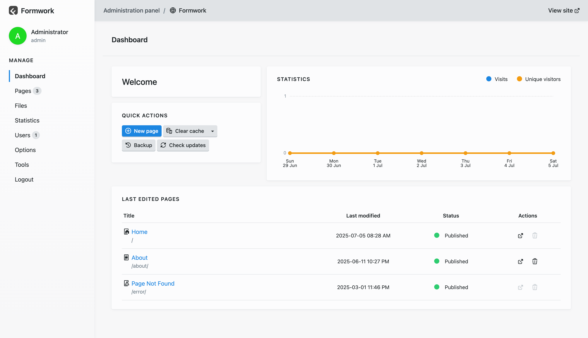

Formwork is a flat-file CMS designed to be fast, flexible, and easy to use, without the need for a database.

This guide will walk you through installing and running Formwork on your local machine or server.

## Requirements

To run Formwork, your server environment must meet the following requirements:

* PHP **8.3** or higher
* PHP extensions: `dom`, `fileinfo`, `gd`, `mbstring`, `openssl` and `zip`

> [!TIP]
> You can check if your PHP installation meets these requirements by running `php -m` to list loaded extensions.

## Installing

You can install Formwork in two main ways: using a **prebuilt release** or via the **[Composer](https://getcomposer.org/) package manager**.

> [!TIP]
> For most users, the prebuilt release is the easiest way to get started. If you are familiar with Composer and prefer to manage dependencies that way, you can use the Composer method.

### Downloading a prebuilt GitHub release

* Visit the latest [Formwork release page on GitHub](https://github.com/getformwork/formwork/releases/latest).
* Download the `formwork-2.x.x.zip` archive.
* Extract the contents into your project folder or in the webroot of your server (e.g., `htdocs/`, or `www/`).

That's it — Formwork is ready to run. You can now access it from your browser.

### Creating a Composer project

If you prefer to manage your installation with [Composer](https://getcomposer.org/), use the following command:

```shell
composer create-project getformwork/formwork
```

This will create a new `📂 formwork` directory with a full installation of the CMS.

Once installed, you can open the project in your browser or use the built-in server as described below.

> [!NOTE]
> Composer will automatically install all PHP dependencies required by Formwork.

> [!TIP]
> You can specify a different directory by adding the desired path at the end of the command, like this:
>
> ```shell
> composer create-project getformwork/formwork my-formwork-site
> ```

#### Building Panel assets

> [!NOTE]
> This step is only necessary if you installed Formwork via Composer. If you downloaded the prebuilt release, the assets are already built.

* Install [Node.js](https://nodejs.org/) and [Yarn](https://yarnpkg.com/)
* Navigate to the `📂 panel` directory:

   ```shell
   cd panel
   ```
* Install dependencies:

   ```shell
   yarn install
   ```
* Build the assets:

   ```shell
   yarn build
   ```


## Running Formwork server

Formwork includes a development server powered by the [PHP Built-in Web Server](https://www.php.net/manual/en/features.commandline.webserver.php).

This allows you to test your site quickly without configuring a full server stack.

> [!WARNING]
> The Formwork server is for **development and testing only**. Do not use it in a production environment.

To start the server, you need to have PHP installed and available in your system's `PATH`. Then you can simply run:

```shell
php bin/serve
```

The `serve` command starts the server at `http://127.0.0.1:8080`.

It will output something like:

<pre class="language-shell"><span style="color: cyan; font-weight: bold;">Formwork 2.0.0</span> <span style="color: silver;">Server ready in 29 ms</span>

PHP runtime 8.3.22

➜ Listening on <span style="color: cyan;">http://127.0.0.1:<span style="font-weight: bold;">8000</span>/</span>

<span style="color: silver;">Press CTRL+C to stop</span></pre>

After navigating to `http://127.0.1:8080` in your browser, you should see the default Formwork welcome page.

The terminal will show logs of requests made to the server, including the **HTTP method**, **status code**, requested **path**, and approximated **response time**.

For example:

<pre class="language-shell"><span style="color: silver;">2025-07-06 00:28:03</span> <span style="color: deepskyblue;">200</span> <span style="font-weight: bold;">GET</span> / <span style="color: silver;">~108 ms</span>
<span style="color: silver;">2025-07-06 00:28:03</span> <span style="color: limegreen;">304</span> <span style="font-weight: bold;">GET</span> /site/templates/assets/css/style.css <span style="color: silver;">~20 ms</span>
<span style="color: silver;">2025-07-06 00:28:03</span> <span style="color: deepskyblue;">200</span> <span style="font-weight: bold;">GET</span> /site/templates/assets/js/script.js <span style="color: silver;">~7 ms</span>
<span style="color: silver;">2025-07-06 00:28:03</span> <span style="color: limegreen;">304</span> <span style="font-weight: bold;">GET</span> /index/panel.png <span style="color: silver;">~18 ms</span>
<span style="color: silver;">2025-07-06 00:28:13</span> <span style="color: deepskyblue;">200</span> <span style="font-weight: bold;">GET</span> /blog/ <span style="color: silver;">~36 ms</span>
<span style="color: silver;">2025-07-06 00:29:46</span> <span style="color: gold;">404</span> <span style="font-weight: bold;">GET</span> /random-page/ <span style="color: silver;">~29 ms</span>
<span style="color: silver;">2025-07-06 00:37:40</span> <span style="color: limegreen;">302</span> <span style="font-weight: bold;">GET</span> /panel/ <span style="color: silver;">~30 ms</span>
<span style="color: silver;">2025-07-06 00:37:40</span> <span style="color: deepskyblue;">200</span> <span style="font-weight: bold;">GET</span> /panel/login/ <span style="color: silver;">~30 ms</span>
<span style="color: silver;">2025-07-06 00:37:41</span> <span style="color: limegreen;">302</span> <span style="font-weight: bold;">POST</span> /panel/login/ <span style="color: silver;">~637 ms</span>
<span style="color: silver;">2025-07-06 00:37:41</span> <span style="color: deepskyblue;">200</span> <span style="font-weight: bold;">GET</span> /panel/dashboard/ <span style="color: silver;">~42 ms</span>
</pre>

To stop the server, simply press <kbd>CTRL</kbd> + <kbd>C</kbd> in the terminal where it is running.

> [!TIP]
> If you prefer you can use Composer to run the `serve` command:
>
> ```shell
> composer serve
> ```

## Using a web server

Formwork does require a minimal web server configuration to handle requests properly.

You will need to rewrite all requests to non-existing files to `index.php` and block the direct access to text files and the `📂 backup`, `📂 bin`, `📂 cache`, `📂 formwork`, `📂 panel`, `📂 site`, and `📂 vendor` folders.

> [!NOTE]
> If you are using [Apache](https://httpd.apache.org/) webserver, your installation is zero-config, as Formwork comes with a preconfigured `.htaccess` file. The configuration basically uses Apache's `mod_rewrite` to make all URI to be processed by the entry point `index.php`.

## Folder structure overview

Here's a quick look at the main folders in a typical Formwork installation:

| Folder                           | Description |
|------------------------------------------------------------|-------------|
| `📂 backup`                      | Stores backups of the site content and configuration|
| `📂 bin`                         | Contains CLI tools, including the development server (`serve`). |
| `📂 cache`                       | Stores cached data (pages, config, images, etc.)|
| `📂 formwork`                    | Core Formwork application files. Should not be modified directly. |
| `📂 panel`                       | Administration panel resources. Should not be modified directly. |
| `📂 site`                        | Main directory for all site-specific content and configuration. |
| `📂 vendor`                      | Composer-managed dependencies. Do not edit manually. |


> [!NOTE]
> - You should not modify files in these directories directly, except for the `📂 site` folder.
> - The `📂 formwork` and `📂 panel` directories contain the core application code and should be left intact to ensure proper functionality.
> - Updates can overwrite changes in these directories, so it is best to keep customizations in the `📂 site` folder.

### Site folder structure
The `site` folder is where you will spend most of your time while building your Formwork site. It contains all the content, configuration, templates, and user data for your site:

| Folder                           | Description |
|----------------------------------|-------------|
| `📂 site/config`                 | System and site configuration files (`system.yaml`, `site.yaml`). |
| `📂 site/files`                  | Uploaded global files (e.g. media not tied to a specific page or template). |
| `📂 site/pages`                  | Page folders with content (`.md`), metadata, and files. |
| `📂 site/schemes`                | Schemes that define structure for pages, users, files, and config. |
| `📂 site/schemes/config`         | Schemes for the config fields shown in the Panel. |
| `📂 site/schemes/files`          | Schemes for file metadata (e.g. title, description). |
| `📂 site/schemes/pages`          | Schemes for individual page types. |
| `📂 site/schemes/users`          | Schemes for user accounts and roles. |
| `📂 site/statistics`             | Stores site visits statistics. |
| `📂 site/templates`              | PHP templates used to render pages on the frontend. |
| `📂 site/templates/assets`       | Template-specific CSS, JS, or media assets. |
| `📂 site/templates/controllers`  | PHP controllers to add logic for specific templates. |
| `📂 site/templates/layouts`      | Layouts to structure HTML across templates. |
| `📂 site/templates/partials`     | Reusable template fragments (partials) for headers, footers, etc. |
| `📂 site/translations`           | Custom translation files to extend the available language strings. |
| `📂 site/users`                  | User-related data and configuration. |
| `📂 site/users/accounts`         | YAML files for user accounts. |
| `📂 site/users/images`           | Profile images for users. |
| `📂 site/users/roles`            | Role definitions for access control in the Panel. |

## Accessing the Panel

Once Formwork is running, you can access the Administration Panel by visiting the `panel/` route.

Since this is the first time you are accessing the Panel, you will be prompted to create a new user.

This user will be the first administrator account, which you can use to log in and manage your site.



> [!TIP]
> Always use a strong password for your accounts.

> [!WARNING]
> For security reasons, **Panel registration is not available outside the local environment** (i.e. `localhost` or `127.0.0.1`). If you are already running Formwork on a remote server, you can register from your local environment and then copy the `📂 site/users/accounts/` folder to the remote server.

After the registration, you will be redirected to the Panel dashboard, where you can manage your site content, users, and settings:


